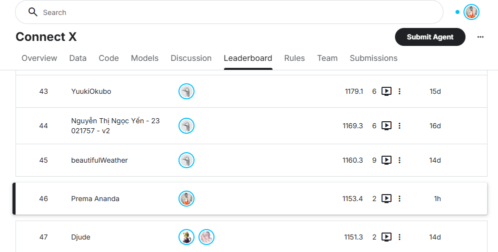
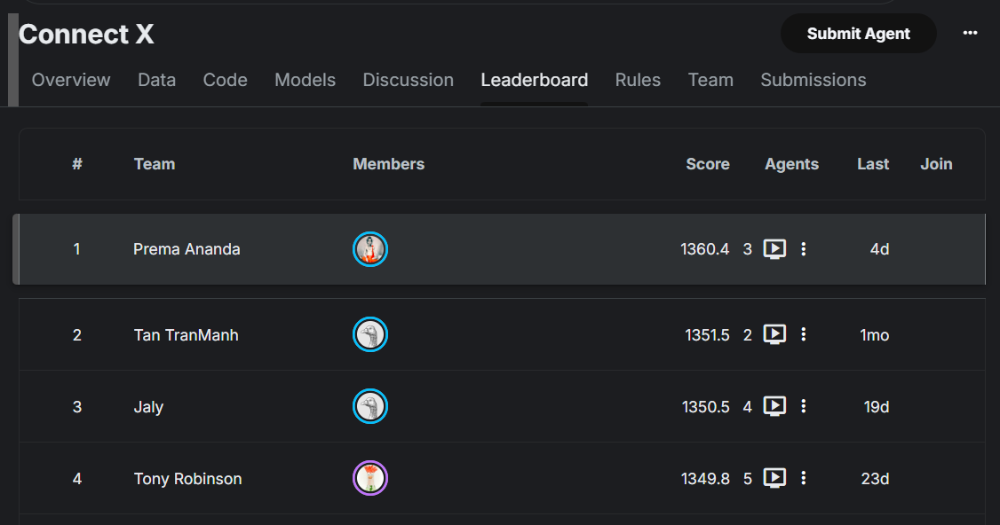

# How I Engineered a Top-50 Connect Four Bot for Kaggle 

Connect Four (known as ConnectX on Kaggle) is a classic board game that many of us played in childhood. Mathematically, it is a solved game: if both players make no mistakes, the first player will always win. 

However, translating this mathematical certainty into a competitive bot on a platform like Kaggle is a completely different challenge. You are bound by strict execution limits, memory constraints, and file size limits. Yet, the results exceeded expectations: **just one hour after uploading to the server, my new agent under the username Prema Ananda successfully secured 46th place on the** [Kaggle ConnectX Global Leaderboard](https://www.kaggle.com/competitions/connectx/leaderboard)!

This is the story of how I went from submitting a basic heuristic agent to building a highly competitive bot tested against absolute mathematical perfection.

---

### Step 1: The Baseline Submission (166th Place)

My journey in the ConnectX competition began with simple curiosity. First, I wrote a basic heuristic Python agent using a standard board evaluation (counting potential threats and cell weights) and submitted it to Kaggle. 

To my surprise, this baseline agent performed remarkably well and climbed to **166th place** in the global ranking. 

It was a great start, but the Kaggle leaderboard is a dynamic environment. Near the top, you hit a wall of highly optimized bots. I quickly realized that to climb further, I needed a way to test, compare, and evolve my algorithms rapidly.

---

### Step 2: Building a Local Testing Arena

To speed up my development cycle, I built a custom testing framework—a local **Arena**—directly on my laptop. 

This arena allowed me to run dozens of matches between different versions of my bots in parallel processes. Instead of waiting hours for matchmaking results on Kaggle's servers, I could evaluate the effectiveness of a new heuristic or search depth in just a few minutes.

From that point on, a series of experiments began. I created different bot versions, testing various algorithmic solutions:
* Classic Negamax with Alpha-Beta pruning.
* History Heuristic for optimal move ordering.
* Various weight functions to evaluate board safety.

Each approach had its merits, but they all hit the same bottleneck: **the opening stage**. On the first few moves, the board is wide open, the branching factor is at its maximum, and calculating deep enough within the 2-second per-turn limit in Python is computationally unfeasible.

---

### Step 3: The Opening Book

The solution lay at the intersection of theory and optimization: dividing the game into two phases—**the opening** and **the middlegame/endgame**.

If the beginning of the game is too complex to calculate on the fly, it must be calculated beforehand. I decided to generate my own opening book—covering the first **18 plies (9 full moves)** of the game. For every possible position at this stage, the database would store a single, mathematically best move.

This introduced a serious technical hurdle: Kaggle imposes strict time limits on container initialization during start, and heavy files can cause cold-start timeouts. 

The solution was rigorous game-tree pruning (Best-Play Pruning). Instead of saving all branches, we recorded only our single best move while preparing for any possible opponent reply. This compressed the database significantly:
* **Player 1 database**: ~154,000 positions.
* **Player 2 database**: ~293,000 positions.
* **Total size in a ZIP archive**: only about **7 MB**!

Such a file loads into Python's memory on the Kaggle server in just 0.3 seconds, providing the bot with a safe start and a massive reserve of precise opening knowledge up to 18 plies deep.

---

### Step 4: Stress-Testing Against Perfection

To verify the reliability of our opening book and search engine, I needed an opponent that made absolutely no mistakes. 

I configured the local Arena to run a match against the **original C++ Connect Four solver**, running in real-time on every turn. This solver acts as a mathematical oracle—it knows the exact game-theoretic evaluation of every step from start to finish.

A grueling **30-game match** between my new bot (with the 18-ply database) and the C++ oracle concluded with the following result:

* **My Bot (`AB_Bit_v3`)**: 15 wins (50.0%)
* **Perfect C++ Solver**: 15 wins (50.0%)
* **Draws**: 0

Since Connect Four is a mathematically proven win for the first player, this **15–15** result means that **Player 1 won 100% of all games**. 

When my bot went first, it played with precise accuracy from the book, transitioned to its optimized search engine, and within just a few middlegame moves, forced a victory against a perfect, non-erring C++ oracle.

---

### Step 5: The AI Co-Author—Saving Weeks on a Pet Project

Since this project is a pure hobby (a non-commercial pet project with zero budget), it is very easy to lose motivation. When you hit frustrating system errors like process deadlocks on the boundary of Python threads and a background C++ solver, it's highly tempting to just throw in the towel. Figuring out all these low-level nuances on my own would have taken weeks of tedious documentation reading, and my patience likely would have run out.

An invaluable catalyst and partner in this work was an AI assistant: the **Gemini 3.5 Flash (High)** large language model. Acting as a virtual Senior Developer, it helped rapidly diagnose system pipeline errors, correct subtle logical bugs in bitwise operations, and suggest micro-optimizations. This turned a potentially exhausting debugging process into a fast, engaging, and highly productive adventure.

---

### Conclusion

By combining a mathematically verified opening book with a fast search engine (averaging about **51.6k Nps** in Python), I was able to build an agent that plays with the precision of a perfect C++ solver during the most critical phases of the game.

The final ZIP archive, weighing just 7 MB, was successfully uploaded to the Kaggle servers. Just **1 hour** after submission, this new version under the handle **Prema Ananda** has already secured **46th place** on the [Kaggle ConnectX Global Leaderboard](https://www.kaggle.com/competitions/connectx/leaderboard) while continuing its evaluation matches.

If you are working on game AI, remember: you don't always need a supercomputer to build highly competitive solutions. A laptop, a local arena, an AI partner at hand, and a structured approach to optimizing bottlenecks can take you remarkably far.

---

**P.S. (Update):** Just 24 hours after publishing this article, the agent has climbed significantly higher in the rankings and now consistently places in the **Top 20** (out of 461 teams) on the global leaderboard.

